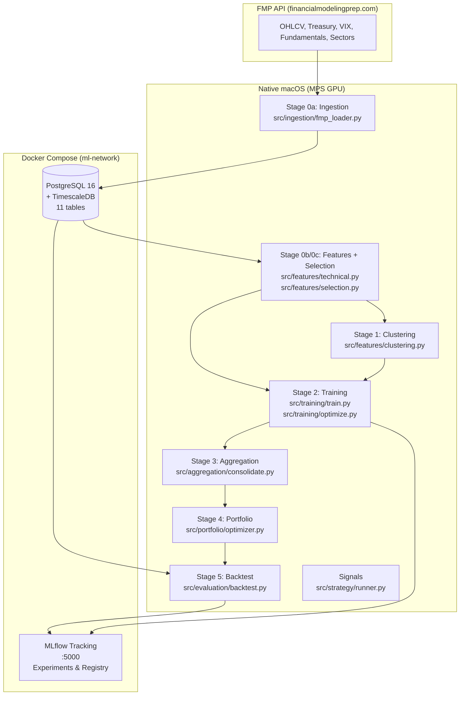

# AGENTS.md — Trading ML Pipeline Context

> **Purpose**: Context file for AI assistants working on this trading ML pipeline. Use this as the primary source of truth for architecture decisions, workflows, and technical details.

---

## TL;DR (Executive Summary)

- **What**: Local ML pipeline for stock trading strategies on S&P 500 stocks
- **Platform**: Mac Mini M4 Pro (24GB RAM) with Apple MPS GPU acceleration
- **Architecture**: Hybrid Docker (infrastructure) + Native macOS (compute)
- **Pipeline**: 5 stages from data ingestion to backtesting
- **Model**: Per-cluster LSTM binary classifiers (UP/NOT_UP prediction)
- **Output**: `prob_up` — probability of stock rising ≥ threshold in horizon days
- **Portfolios**: 3 risk-profiled long-only portfolios (Aggressive, Moderate, Conservative)

---

## Quick Reference Tables

### Makefile Commands

| Command | Stage | Description |
|---------|-------|-------------|
| `make up` | Setup | Start PostgreSQL + MLflow containers |
| `make down` | Setup | Stop all Docker containers |
| `make ingest` | 0a | Fetch data from FMP API → PostgreSQL |
| `make features` | 0b | Generate features → `data/features.parquet` |
| `make select-features` | 0c | Feature selection → `data/features_selected.parquet` |
| `make cluster` | 1 | Cluster stocks by sector → `data/clusters.parquet` |
| `make train` | 2 | Train LSTM per cluster with MPS GPU |
| `make train-cluster CLUSTER=X` | 2 | Train single cluster only |
| `make aggregate` | 3 | Consolidate predictions → `data/predictions.parquet` |
| `make portfolio` | 4 | Optimize 3 portfolio profiles → `data/portfolios.parquet` |
| `make backtest` | 5 | Regime-aware backtesting |
| `make promote` | — | Register best models as champions in MLflow |
| `make signals` | — | Generate trading signals from champion models |
| `make pipeline` | All | Run full pipeline: ingest → train → backtest |
| `make pipeline-loop` | All | Infinite pipeline loop (Ctrl+C to stop) |

### Environment Variables

| Variable | Required | Default | Description |
|----------|----------|---------|-------------|
| `FMP_API_KEY` | Yes | — | financialmodelingprep.com API key |
| `POSTGRES_HOST` | No | `localhost` | Database host |
| `POSTGRES_PORT` | No | `5432` | Database port |
| `POSTGRES_DB` | No | `trading` | Database name |
| `POSTGRES_USER` | No | `trading` | Database user |
| `POSTGRES_PASSWORD` | Yes | — | Database password |
| `MLFLOW_TRACKING_URI` | No | `http://localhost:5000` | MLflow server URL |
| `PIPELINE_ENV` | No | `dev` | `dev` (8yr) or `prod` (20yr) mode |

### Project Structure

```
ai-pipeline/
├── AGENTS.md                      # This file — AI assistant context
├── CLAUDE.md                      # Cursor/Claude specific context (legacy)
├── README.md                      # User-facing documentation
├── Makefile                       # Task runner and orchestration
├── docker-compose.yml             # PostgreSQL + TimescaleDB + MLflow
├── pyproject.toml                 # UV dependency manifest
├── configs/
│   └── default.yaml               # All hyperparameters and config
├── src/
│   ├── config.py                  # Config loading, SplitDates, date computation
│   ├── db.py                      # SQLAlchemy schema (11 tables)
│   ├── keys.py                    # Environment variable loading
│   ├── ingestion/
│   │   └── fmp_loader.py          # Stage 0a: FMP API → PostgreSQL
│   ├── features/
│   │   ├── technical.py           # Stage 0b: Feature engineering
│   │   ├── selection.py           # Stage 0c: Feature selection
│   │   └── clustering.py          # Stage 1: Stock clustering
│   ├── models/
│   │   ├── base_model.py          # LSTMForecaster (Lightning module)
│   │   └── dataset.py             # TradingDataModule with temporal splits
│   ├── training/
│   │   ├── train.py               # Stage 2: Per-cluster training
│   │   └── optimize.py            # Hyperparameter optimization with Optuna
│   ├── aggregation/
│   │   └── consolidate.py         # Stage 3: Prediction consolidation
│   ├── portfolio/
│   │   ├── metrics.py             # Risk metrics (Sharpe, Sortino, etc.)
│   │   └── optimizer.py           # Stage 4: Portfolio optimization
│   ├── evaluation/
│   │   ├── backtest.py            # Stage 5: Regime-aware backtesting
│   │   ├── regime.py              # Market regime detection
│   │   ├── promote.py             # Model registry promotion
│   │   ├── champion.py            # Champion model loader
│   │   ├── precision_eval.py      # Precision-focused evaluation
│   │   └── clean_runs.py          # MLflow cleanup utility
│   └── strategy/
│       └── runner.py              # Signal generation from champions
├── docs/                          # Detailed documentation per stage
├── data/                          # Pipeline artifacts (gitignored)
└── tests/                         # pytest test suite
```

---

## Architecture Overview

### Hybrid Docker / Native Architecture



### Why Hybrid?

- **Docker**: Runs Linux VMs — PyTorch has NO access to Apple MPS GPU
- **Native**: macOS gives full MPS acceleration for model training
- **Infrastructure**: PostgreSQL and MLflow run perfectly in containers with isolation and easy teardown

---

## 5-Stage Pipeline

### Stage 0a: Data Ingestion

**File**: `src/ingestion/fmp_loader.py`  
**Command**: `make ingest`

Connects to FMP API and fetches 7 data sources into PostgreSQL:

| Source | FMP Endpoint | DB Table | Description |
|--------|--------------|----------|-------------|
| OHLCV | `/historical-price-eod/full` | `ohlcv_daily` | Daily OHLCV + volume |
| Adj Close | `/historical-price-eod/dividend-adjusted` | `ohlcv_daily.adj_close` | Dividend-adjusted prices |
| Treasury Rates | `/treasury-rates` | `treasury_rates` | 12 tenors (1M to 30Y) |
| VIX | `/historical-price-eod/full?symbol=^VIX` | `vix_daily` | Volatility index |
| Key Metrics | `/key-metrics/{symbol}?period=quarter` | `key_metrics_quarterly` | ~47 fields (JSONB) |
| Financial Ratios | `/ratios/{symbol}?period=quarter` | `financial_ratios_quarterly` | ~66 fields (JSONB) |
| Sector Performance | `/historical-sector-performance` | `sector_performance_daily` | Daily sector avg change |
| GICS Sectors | `/profile/{symbol}` | `stock_sectors` | Sector mapping per symbol |

**Smart adjClose Refresh**: Instead of re-downloading 20 years for all ~500 symbols daily, probes 3 historical dates per symbol. Only triggers full re-download if values changed (dividends/splits).

### Stage 0b/0c: Feature Engineering & Selection

**Files**: `src/features/technical.py`, `src/features/selection.py`  
**Commands**: `make features`, `make select-features`

#### Feature Categories (11 categories)

| Category | Features | Description |
|----------|----------|-------------|
| Moving Averages | `sma_{w}_ratio`, `ema_{w}_ratio` | Price-relative ratios at windows [5,10,20,50,200] |
| Momentum | `rsi_14`, `macd_ratio`, `stoch_k`, `stoch_d` | Oscillators and trend indicators |
| Volatility | `bb_upper_ratio`, `bb_lower_ratio`, `atr_14_ratio`, `realized_vol_{w}d` | Risk measures |
| Volume | `relative_volume`, `obv_roc_20d` | Volume-based indicators |
| Returns | `return_1d`, `return_5d`, `return_20d` | Forward returns from adj_close |
| Macro | 12 tenors, 8 spreads, curve slope, lagged | Treasury yield features |
| VIX | `vix_close`, `vix_sma_{w}`, `vix_percentile_252d` | Volatility index features |
| Cross-Sectional | `relative_strength_spy_20d` | Performance vs SPY |
| Fundamentals | `km_*` (20 fields), `fr_*` (20 fields), `*_qoq` | Quarterly metrics + QoQ changes |
| Sector | `sector_avg_change`, `sector_momentum_{w}d` | Sector-relative features |
| Time Encoding | `dow_sin/cos`, `moy_sin/cos` | Cyclical time features |

#### Feature Selection (3 Filters)

1. **Null filter**: Drop features with >90% nulls
2. **Variance filter**: Drop bottom 1% by variance
3. **Correlation filter**: Drop one of each pair with |correlation| > 0.95

Output:
- `data/features.parquet` — all features
- `data/features_selected.parquet` — filtered features (if enabled)
- `data/selected_features.json` — manifest of selected feature names

### Stage 1: Stock Clustering

**File**: `src/features/clustering.py`  
**Command**: `make cluster`

Groups stocks into behaviorally similar clusters using KMeans:

1. **Features per stock** (19 features computed from training period only):
   - Behavioral (7): return_20d_mean, volatility_60d, volume_profile, rsi_14_mean, beta_60d, momentum_60d, drawdown_max
   - Macro sensitivity (2): vix_beta, yield_sensitivity
   - Sector-relative (1): relative_to_sector_avg
   - Fundamentals (9): km_returnOnEquity, km_earningsYield, fr_grossProfitMargin, etc.

2. **Algorithm**:
   - Handle NaN (median fill)
   - StandardScaler
   - PCA (retain 95% variance)
   - Silhouette search: K = min_clusters..max_clusters
   - KMeans with optimal K
   - Merge clusters smaller than min_cluster_size

Output: `data/clusters.parquet` — symbol, cluster_id, sector

### Stage 2: Model Training

**Files**: `src/training/train.py`, `src/models/base_model.py`, `src/models/dataset.py`  
**Commands**: `make train`, `make train-cluster CLUSTER=X`

#### Model: LSTMForecaster (PyTorch Lightning)

| Parameter | Default | Description |
|-----------|---------|-------------|
| `hidden_size` | 96 | LSTM hidden dimension |
| `num_layers` | 2 | LSTM layers |
| `dropout` | 0.35 | Dropout rate |
| `sequence_length` | 20 | Input window size |
| `num_classes` | 2 | Binary: NOT_UP=0, UP=1 |

#### Target Definition

- **UP (1)**: Stock rises ≥ `buy_threshold` (default +2.5%) in `horizon` days (default 21)
- **NOT_UP (0)**: Everything else

#### Training Configuration

| Parameter | dev | prod | Description |
|-----------|-----|------|-------------|
| `batch_size` | 256 | 128 | Training batch size |
| `max_epochs` | 20 | 200 | Maximum epochs |
| `learning_rate` | 0.0005 | — | AdamW learning rate |
| `weight_decay` | 0.05 | — | L2 regularization |
| `label_smoothing` | 0.05 | — | Prevents overconfidence |
| `focal_gamma` | 2.0 | — | Focal loss gamma |
| `noise_std` | 0.03 | — | Gaussian noise augmentation |
| `early_stopping_patience` | 7 | 15 | Patience for early stopping |

#### Temporal Splits (Relative to Today)

```
train (17yr) │ PURGE 21d │ val (1yr) │ PURGE 21d │ test (1yr) │ today
```

- 21-day purge gaps prevent label leakage (matches target horizon)
- Features normalized using training-set statistics only
- Symbol-boundary-aware windowing prevents crossing stock boundaries

#### Hyperparameter Optimization (Optuna)

Enabled via `training.optuna`:
- `n_trials`: 30 trials per cluster
- `min_recall_up`: 0.10 minimum recall threshold
- Studies persisted in PostgreSQL for warm-starting

### Stage 3: Prediction Aggregation

**File**: `src/aggregation/consolidate.py`  
**Command**: `make aggregate`

Loads champion checkpoint for each cluster, runs inference, outputs `prob_up` for all stocks:

1. Load features (from `features_selected.parquet` if enabled)
2. Load per-cluster champion model from MLflow Model Registry
3. For each symbol: extract last `seq_len` rows, normalize, forward pass
4. `prob_up = P(UP) = softmax(output)[1]`

Output: `data/predictions.parquet` — symbol, cluster_id, prob_up, model_run_id

### Stage 4: Portfolio Optimization

**Files**: `src/portfolio/optimizer.py`, `src/portfolio/metrics.py`  
**Command**: `make portfolio`

Constructs 3 long-only portfolios with different risk profiles:

| Parameter | Aggressive | Moderate | Conservative |
|-----------|------------|----------|--------------|
| Primary metric | Sortino | Sharpe | Calmar |
| Complementary metric | Omega | Calmar | Sortino |
| Validation metric | Information | Sortino | Sharpe |
| `min_prob_up` | 0.60 | 0.65 | 0.70 |
| `max_positions` | 25 | 20 | 15 |
| `max_sector_weight` | 0.30 | 0.25 | 0.20 |

**Constraints**:
- Weights sum to 1.0 (fully invested)
- Max single position: 10%
- Min single position: 1%
- Sector weight limits per profile

**Optimization**: scipy SLSQP minimizing negative blended metric (0.8 × primary + 0.2 × complementary)

Output: `data/portfolios.parquet` — profile, symbol, weight, cluster_id, prob_up

### Stage 5: Regime-Aware Backtesting

**Files**: `src/evaluation/backtest.py`, `src/evaluation/regime.py`  
**Command**: `make backtest`

#### Market Regime Detection (SPY-based)

| Regime | Conditions |
|--------|------------|
| **bull** | annualized_return > +10% AND SMA_50 > SMA_200 |
| **bear** | annualized_return < -10% AND SMA_50 < SMA_200 |
| **sideways** | Otherwise |

#### Backtest Simulation

9 simulations per run: 3 profiles × 3 regimes

**Risk Management**:
| Parameter | Default | Description |
|-----------|---------|-------------|
| `position_stop_loss` | 8% | Exit position at -8% |
| `position_take_profit` | 50% | Exit position at +50% |
| `max_drawdown_limit` | 25% | Circuit breaker trigger |
| `cooldown_days` | 2 | Days in cash after circuit breaker |
| `commission_pct` | 0.1% | Per-trade commission |

Output: `backtest_results` table with metrics per (profile, regime)

---

## Database Schema

| Table | Purpose | Key Columns |
|-------|---------|-------------|
| `ohlcv_daily` | Daily price data | symbol, date, open, high, low, close, adj_close, volume |
| `treasury_rates` | US Treasury yields | date, month1..year30 (12 tenors) |
| `vix_daily` | VIX index | date, open, high, low, close |
| `key_metrics_quarterly` | Fundamental metrics | symbol, date, data (JSONB) |
| `financial_ratios_quarterly` | Financial ratios | symbol, date, data (JSONB) |
| `sector_performance_daily` | Sector returns | date, sector, average_change |
| `stock_sectors` | GICS mapping | symbol, sector |
| `cluster_assignments` | Cluster output | symbol, cluster_id, sector |
| `predictions` | Model predictions | run_date, symbol, cluster_id, prob_up |
| `portfolio_allocations` | Portfolio weights | run_date, profile, symbol, weight, prob_up |
| `backtest_results` | Backtest metrics | run_date, profile, regime, sharpe, sortino, ... |

---

## Configuration Reference

**Location**: `configs/default.yaml`

### Key Sections

```yaml
# Data ingestion
ingestion:
  source: sp500                          # dynamic from FMP API
  benchmark_symbols: [SPY]
  start_years_back: {dev: 8, prod: 20}  # relative to today

# Feature engineering
features:
  windows: [5, 10, 20, 50, 200]
  indicators: [sma, ema, rsi, macd, ...]  # see full list in file

# Feature selection
feature_selection:
  enabled: true
  max_null_pct: 0.90
  max_correlation: 0.95
  min_variance_pct: 0.01

# Target definition
target:
  horizon: 21            # trading days
  buy_threshold: 0.025   # +2.5%

# Model architecture
model:
  type: lstm
  hidden_size: 96
  num_layers: 2
  dropout: 0.35
  sequence_length: 20

# Training parameters
training:
  batch_size: {dev: 256, prod: 128}
  max_epochs: {dev: 20, prod: 200}
  learning_rate: 0.0005
  weight_decay: 0.05
  optuna: {...}          # hyperparameter optimization

# Clustering
clustering:
  max_clusters: 10
  min_clusters: 3
  pca_variance_ratio: 0.95
  cluster_thresholds: {}  # per-cluster buy_threshold overrides

# Portfolios
portfolio:
  profiles: {aggressive: {...}, moderate: {...}, conservative: {...}}
  constraints:
    max_single_position: 0.10
    min_single_position: 0.01

# Backtesting
backtest:
  initial_capital: 100000
  commission_pct: 0.001
  slippage_bps: 5
  risk: {...}
```

---

## Common Tasks

### Train a Specific Cluster

```bash
make train-cluster CLUSTER=Technology_0
# or
uv run python -m src.training.train --cluster Technology_0
```

### Generate Trading Signals

```bash
make signals
# or for specific symbols
uv run python -m src.strategy.runner --symbols AAPL NVDA TSLA
```

### View MLflow Experiments

```bash
open http://localhost:5000
```

### Database Access

```bash
docker exec -it trading-postgres psql -U trading -d trading
```

### Run Tests

```bash
make test
# or
uv run pytest tests/ -v
```

### Debug Feature Mismatch

If you see `ValueError: Feature count mismatch`:
1. Check if `feature_selection.enabled` changed between training and inference
2. Verify `data/selected_features.json` exists and matches model's training features
3. Re-run `make select-features` if needed

---

## Key Files Reference

| File | Purpose |
|------|---------|
| `src/config.py` | Config loading, SplitDates, compute_split_dates() |
| `src/db.py` | SQLAlchemy models for all 11 tables |
| `src/keys.py` | Environment variable loading |
| `src/models/base_model.py` | LSTMForecaster Lightning module |
| `src/models/dataset.py` | TradingDataModule with temporal splits |
| `src/evaluation/regime.py` | Bull/bear/sideways detection |
| `src/evaluation/promote.py` | Model registry promotion logic |
| `src/evaluation/champion.py` | Champion checkpoint loader |

---

## Tech Stack

| Layer | Tool | Purpose |
|-------|------|---------|
| Data source | FMP API | OHLCV, adj close, treasury, VIX, fundamentals, sectors |
| Database | PostgreSQL + TimescaleDB | Time-series storage, 11 tables |
| Feature engineering | Polars | Rolling windows, joins, transforms |
| Clustering | scikit-learn | KMeans, PCA, silhouette scoring |
| ML framework | PyTorch + Lightning | LSTM binary classifier (UP/NOT_UP) |
| Hyperparameter optimization | Optuna | Automated hyperparameter search |
| Portfolio optimization | scipy | SLSQP multi-objective optimization |
| Experiment tracking | MLflow | Tracking, registry, artifact store |
| Dependency management | UV | Fast Python package manager |
| Orchestration | Makefile | Task runner |
| Containerization | Docker Compose | Postgres + MLflow infrastructure |

---

## Important Notes / Gotchas

1. **MPS GPU is macOS-only**: Training must run natively on macOS, not in Docker. PyTorch in Docker on Apple Silicon cannot access MPS.

2. **Purge gaps prevent label leakage**: The 21-day gaps between train/val/test splits are critical. They match the target horizon to prevent leaking future price information.

3. **adj_close consistency**: All price-derived indicators (SMAs, EMAs, etc.) use `adj_close` when available. This ensures indicators align with target labels which also use adj_close.

4. **Champion models**: The promotion step sets a `champion` alias in MLflow Model Registry. Signal generation (`make signals`) always loads from the registry, not local files.

5. **Feature selection must match**: If `feature_selection.enabled=true`, training, aggregation, and inference all use `features_selected.parquet`. Changing this setting requires re-training.

6. **Temporal splits are relative to today**: All date boundaries are computed from `date.today()`. This enables daily retraining without manual date updates.

7. **Symbol-boundary-aware windowing**: The dataset ensures no LSTM sequence crosses from one stock to another via `valid_indices` tracking.

8. **Per-cluster models**: Each cluster has its own LSTM model and MLflow experiment (`cluster/{cluster_id}`). This allows specialization but means you need champions for all clusters to generate full signals.

---

## Stage Documentation

For detailed documentation on each stage, see:

- [docs/stage-0-ingestion.md](docs/stage-0-ingestion.md) — Data ingestion
- [docs/stage-0-features.md](docs/stage-0-features.md) — Feature engineering & selection
- [docs/stage-1-clustering.md](docs/stage-1-clustering.md) — Stock clustering
- [docs/stage-2-training.md](docs/stage-2-training.md) — Model training
- [docs/stage-3-aggregation.md](docs/stage-3-aggregation.md) — Prediction aggregation
- [docs/stage-4-portfolio.md](docs/stage-4-portfolio.md) — Portfolio optimization
- [docs/stage-5-backtest.md](docs/stage-5-backtest.md) — Backtesting & regime detection
- [docs/signals-and-promotion.md](docs/signals-and-promotion.md) — Model promotion & signal generation
- [docs/architecture.md](docs/architecture.md) — Detailed architecture overview

---

## Model Promotion (Champion Selection)

The promotion logic uses a precision-focused cascading elimination algorithm in `src/evaluation/promote.py`:

1. **Walk-forward validation**: Testing on multiple windows (63 days, stepping 21 days)
2. **Stability scoring**: Penalty for high variance in precision across windows
3. **Precision thresholds**: Cascading evaluation at [0.50, 0.55, 0.60, 0.65, 0.70, 0.75, 0.80]
4. **Minimum constraints**: min_recall (0.10), min_signals_per_window (5)
5. **Tiebreaking**: False positive severity analysis within margin (0.01)

The best model per cluster is registered as `champion` in MLflow Model Registry with alias pointing to the checkpoint artifact.

---

*Last updated: Context file generated for AI assistant use. Refer to specific docs/ files for detailed implementation notes.*
